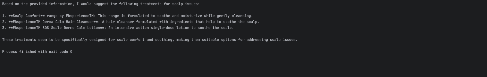

# RAG with Langchain
> This is a simple guide showing how to use Retrieval-Augmented Generation (RAG) with Langchain and an LLM (Llama 3.1) to help answer questions from PDF documents.

1. RAG is a technique that improves the quality of answers by retrieving relevant information from external sources (like a PDF) before generating a response.
2. Langchain is a framework that helps connect language models with external data sources and tools.
3. LLM (Llama 3.1) is the language model used to generate the answers.

> The example demonstrates how to combine these technologies to search through PDF documents and generate answers based on their content.

## Additional resources
- [langchain-huggingface](https://python.langchain.com/v0.2/docs/integrations/platforms/huggingface/)
- [Document loaders using PyPDF](https://python.langchain.com/v0.1/docs/modules/data_connection/document_loaders/pdf/)
- [Vector stores using Chroma](https://python.langchain.com/v0.2/docs/integrations/vectorstores/chroma/)